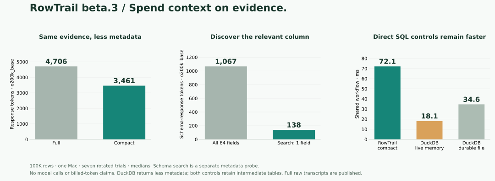

<div align="center">
  
  <h1>RowTrail</h1>
  <p><strong>Explore data. Keep the trail.</strong></p>
  <p>A small native data tool, built for agents.<br>Ask a question, keep a result, and continue from there.</p>
  <p>
    <a href="https://github.com/adam2go/rowtrail/actions/workflows/ci.yml"></a>
    <a href="https://github.com/adam2go/rowtrail/releases/tag/v0.1.0-beta.3"></a>
    <a href="LICENSE"></a>
  </p>
  <p><a href="README.zh-CN.md">简体中文</a> · <a href="#install">Install</a> · <a href="docs/agent-guide.md">Agent guide</a> · <a href="docs/verification.md">Test results</a> · <a href="CONTRIBUTING.md">Contribute</a></p>
</div>

---

An agent should be able to explore a large table without putting the whole table
in its context. RowTrail opens local CSV/TSV/Parquet, runs read-only SQL, and keeps
versioned results on disk. The agent gets a bounded, typed observation and can
branch from a saved result when the next question arrives.

**New in beta.3:** spend context on evidence. Compact responses keep full quality,
wide-schema search finds relevant columns, and one contextual inspection recovers
why a saved result exists. `rowtrail demo` shows discovery → saved analysis →
checks → handoff to a separate process, with no data download or model API.
[Run the demo](docs/agent-demo.md) · [Save, compare and reuse analysis](docs/analysis.md).

No new external dependency. Native archive/CLI/runtime budgets remain
**30 MB / 4.5 MB / 125 MB**. Beta.3 native release verification is pending; the
new gates cover **143 integration scenarios and 14 Rust tests**, installation and
published alpha.8/beta.1 upgrades plus beta.2 schema compatibility.

**Zero internal model calls. No API key. No spreadsheet UI.** Your agent chooses
the questions and decides when the evidence is sufficient.

| Built for | What the agent gets |
|---|---|
| **Observe progress honestly** | Exact row-group-prefix aggregates with explicit coverage and immutable revisions. |
| **Understand unfamiliar data** | On-demand null counts, min/max and exact top-k; every scan has budgets. |
| **Avoid repeated CSV parsing** | Explicit streaming preparation to an immutable Parquet dataset. |
| **Control stored data** | Pin/release, dependency-safe GC and managed-data quotas. |
| **Continue exploring** | Find labeled results, row counts and field hints with `workspace summary`; reuse fixed results through SQL. |
| **Spend context carefully** | Row and byte budgets, paginated observations, exact integer and Decimal representation. |
| **Work beyond one call** | Durable accepted jobs, explicit waiting, events and cancellation. |
| **Reuse and hand off analysis** | Independent snapshots; optional Python checks, keyed diffs, recipes and portable branches. |
| **Stay native and small** | Two executables; no Python, Node, Docker or external database required. |

```text
CSV / TSV / Parquet → SQL query → saved result → next question
                          ↓              ↓
                    bounded observations for your agent
```

## Install

**v0.1.0-beta.3** is a beta preview, licensed under Apache-2.0.
Native packages are available for **macOS arm64** and **Linux x86_64**
(Ubuntu 22.04 / glibc 2.35 or newer).

```sh
curl -fsSL https://raw.githubusercontent.com/adam2go/rowtrail/v0.1.0-beta.3/install.sh -o /tmp/rowtrail-install.sh
sh /tmp/rowtrail-install.sh
export PATH="$HOME/.local/bin:$PATH"
rowtrail --version
```

The installer verifies SHA-256 and installs a versioned pair in `~/.local/bin`.
Set `ROWTRAIL_INSTALL_DIR` to choose another directory, or extract an archive
from [Releases](https://github.com/adam2go/rowtrail/releases/tag/v0.1.0-beta.3).
Keep `rowtrail` and `rowtrail-runtime` together.

The previous beta.2 downloads were **19.42 MB (macOS) / 22.82 MB (Linux)**;
beta.3 artifact measurements are pending native verification.
Budgets remain **30 MB download / 4.5 MB CLI / 125 MB runtime**.
The same Linux archive is tested on Ubuntu 22.04 and 24.04. Archives include
agent guides and the optional runnable demo. Actual sizes and hashes appear in
[artifact verification](docs/verification.md#native-distribution).

**Workspace compatibility:** beta.3 keeps beta.2 metadata schema 9. Close old
sessions and allow the old coordinator to exit before switching versions.
Upgrading from beta.1 or earlier is one-way; preserve a stopped workspace copy
if you need to roll back that schema migration.
Old results keep their original numeric provenance. [Numeric contract](docs/numeric-contract.md).

## Give it a question

This example runs immediately after installation, with no data download:

```sh
rowtrail query --sql "SELECT region, SUM(amount) AS total
  FROM (VALUES ('east', 12), ('east', 8), ('west', 7)) AS orders(region, amount)
  GROUP BY region ORDER BY region"
```

The exact totals are `east = 20` and `west = 7`. The JSON response includes a
stable job reference and, when ready within the wait budget, a bounded result
observation. `ok: true` means acceptance; inspect `job.state` for completion.

For your own files, start with `rowtrail open ./orders.parquet`. Bind the returned
dataset and manifest IDs in SQL, then use a fixed result revision for the next
question. [The complete workflow](docs/usage.md#try-the-exact-exploration-loop)
covers opening, waiting, paging, branching and export. A
[runnable composition example](examples/explore.py) passes the references automatically.
The [alpha.3 end-to-end example](examples/prepare_explore.py) also profiles,
prepares, exports and collects its own intermediate data.
The [progressive example](examples/progressive.py) observes checkpoints and can
explicitly stop once it has enough fragment or file coverage.

## A complete demo, with no data download

```sh
rowtrail demo --directory ./rowtrail-demo
```

The optional stdlib Python demo generates **100,000 orders with 64 columns**,
searches relevant fields, saves qualifying orders without printing them, verifies
four exact totals and a reusable assertion, then reconnects by label and purpose.
A separate process imports the portable branch and asks a new question after the
original CSV is removed. Reports, raw full/compact transcripts, bounded decision
cards and reusable workspaces remain in the directory. Existing paths are never
overwritten. [Walkthrough and continuation](docs/agent-demo.md).

Native queries need no Python; this optional demo does. DuckDB can also retain
connections/tables and return small answers. RowTrail adds common contracts for
quality, fixed versions, context and handoff; it does not claim that a database
cannot do these things with additional application code.

## Connect your agent

| Entry | Use it for | Start here |
|---|---|---|
| CLI | Discovery and one-off calls | `rowtrail guide` · `rowtrail schema query` · `rowtrail doctor` |
| Persistent NDJSON | Many operations in one process | `rowtrail session` · [protocol guide](docs/agent-guide.md) |
| MCP over stdio | Agent tool hosts | `rowtrail --workspace /absolute/private/workspace mcp-config` |
| Rust client | Native programmatic composition | [`Client::session()` example](crates/client/examples/query.rs) |

All entries share the same contracts, jobs and result store. Closing a connection
does not cancel an accepted job. Transport errors never silently replay a
possibly accepted mutation. The optional [Python bridge](examples/session_client.py)
uses only the standard library; Python is not a product dependency. Print it
locally with `rowtrail python-client > rowtrail_client.py`. `open` and `query`
responses can be passed straight into subsequent bindings; mechanical waits need
no extra model turn. [Small bootstrap](docs/agent-quickstart.md).

## Measured, with the receipts

On one Mac, seven 100K-row trials of the same workflow:

| Change | Measured effect |
|---|---:|
| Full → compact native responses | **4,706 → 3,461 response tokens (−26.5%)** |
| Requests + responses, sum of medians | **−20.9%** |
| Relevant field search instead of 64-field schema | **1,067 → 138 tokens** |
| Save 2M-row subset + ten queries + reconnect | **683.78 → 689.54 ms** (beta.2 → beta.3) |
| Five-query 1M-row exploration | **144.62 → 146.23 ms** |

Token counts use `o200k_base` on actual JSON messages. They exclude model prompts,
reasoning, tool schemas, caching and chat framing; they are not model bills.
Both tokenizer encodings and all raw messages are published. Existing large
workloads remain broadly stable, including the small regressions above.



Direct DuckDB remains faster and returns less metadata: **18.12 ms** with a live
memory connection, **34.60 ms** with a reopened durable database, versus
**72.14 ms** for compact RowTrail in the shared task. Both controls retain tables
and return bounded answers. RowTrail adds quality, fixed references, purpose and
handoff contracts; those guarantees cost time and context.

SQLite FULL commits, fsync, SHA-256, checked numeric boundaries and real
cancellation remain. The latest actual paired-agent pilot is still alpha.6:
12 correct answers, but more time and cumulative input tokens than persistent
DuckDB. This release's scripted tokenizer measurements do not replace that trial.
[Measurements and limits](docs/verification.md) · [Raw records and reproduction](benchmarks/performance/beta3/).

## What comes next

Try `rowtrail demo` ([guide](docs/agent-demo.md)) or bring a real
DuckDB/Polars/Pandas workflow. The new composition helpers are Python-only; diffs
scan more than once, and recipes/packages are not whole-operation transactions.
No scheduler or automatic interrupted-run resume is included.

Progressive aggregation supports whole files and row groups, with no GROUP BY or
filters. Sampling/estimates, interrupted-run continuation,
a SQL prepared-plan cache, native MCP Tasks, automatic host resume/eviction and
remote sources remain unimplemented. [Current capabilities and limits](docs/progress.md) are
tracked separately from the roadmap.

We want a useful tool that stays easy to install, compose and understand.
Contributions that make the contracts clearer, the package smaller, or a
complete exploration faster are especially welcome. Start with
[contributing](CONTRIBUTING.md), [launch copy and demo rundown](docs/launch.md), [building from source](docs/usage.md#build), or
[a reproducible issue](https://github.com/adam2go/rowtrail/issues).

<sub>Meet <a href="docs/brand/README.md">Trail / 小迹</a>, our three-row companion. One question, one result, one more step.</sub>
