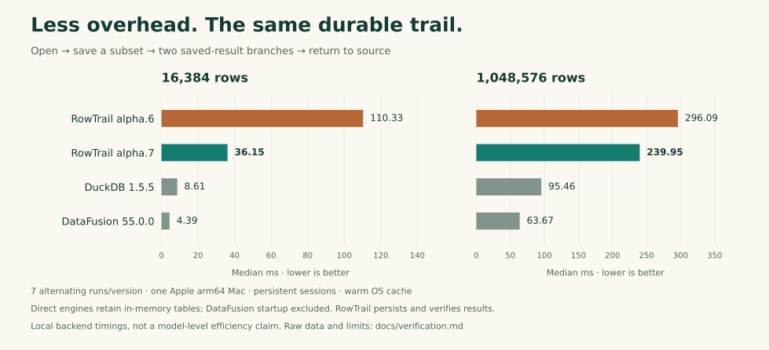

<div align="center">
  
  <h1>RowTrail</h1>
  <p><strong>Explore data. Keep the trail.</strong></p>
  <p>A small native data tool, built for agents.<br>Ask a question, keep an exact result, and continue from there.</p>
  <p>
    <a href="https://github.com/adam2go/rowtrail/actions/workflows/ci.yml"></a>
    <a href="https://github.com/adam2go/rowtrail/releases/tag/v0.1.0-alpha.7"></a>
    <a href="LICENSE"></a>
  </p>
  <p><a href="README.zh-CN.md">简体中文</a> · <a href="#install">Install</a> · <a href="docs/agent-guide.md">Agent guide</a> · <a href="docs/verification.md">Test results</a> · <a href="CONTRIBUTING.md">Contribute</a></p>
</div>

---

An agent should be able to explore a large table without putting the whole table
in its context. RowTrail opens local CSV/TSV/Parquet, runs read-only SQL, and keeps
versioned results on disk. The agent gets a bounded, typed observation and can
branch from a saved result when the next question arrives.

**New in alpha.7:** fast durable small queries, fewer repeated reads, and simpler
agent composition. Local alternating runs reduce warm scalar latency from
**18.12 ms to 1.19 ms** and five-query exploration time by about
**67% / 19%** at 16K / 1M rows. No new external dependency; the download budget stays 30 MB.

**Zero internal model calls. No API key. No spreadsheet UI.** Your agent chooses
the questions and decides when the evidence is sufficient.

| Built for | What the agent gets |
|---|---|
| **Observe progress honestly** | Exact row-group-prefix aggregates with explicit coverage and immutable revisions. |
| **Understand unfamiliar data** | On-demand null counts, min/max and exact top-k; every scan has budgets. |
| **Avoid repeated CSV parsing** | Explicit streaming preparation to an immutable Parquet dataset. |
| **Control stored data** | Pin/release, dependency-safe GC and managed-data quotas. |
| **Continue exploring** | Discover saved bindings with `workspace summary`; reuse fixed results through SQL. |
| **Spend context carefully** | Row and byte budgets, paginated observations, exact integer and Decimal representation. |
| **Work beyond one call** | Durable accepted jobs, explicit waiting, events and cancellation. |
| **Stay native and small** | Two executables; no Python, Node, Docker or external database required. |

```text
CSV / TSV / Parquet → exact query → saved result → next question
                          ↓              ↓
                    bounded observations for your agent
```

## Install

**v0.1.0-alpha.7** is an early engineering preview, licensed under Apache-2.0.
Native packages are available for **macOS arm64** and **Linux x86_64**
(Ubuntu 24.04 / glibc 2.39 or newer).

```sh
curl -fsSL https://raw.githubusercontent.com/adam2go/rowtrail/v0.1.0-alpha.7/install.sh -o /tmp/rowtrail-install.sh
sh /tmp/rowtrail-install.sh
export PATH="$HOME/.local/bin:$PATH"
rowtrail --version
```

The installer verifies SHA-256 and installs a versioned pair in `~/.local/bin`.
Set `ROWTRAIL_INSTALL_DIR` to choose another directory, or extract an archive
from [Releases](https://github.com/adam2go/rowtrail/releases/tag/v0.1.0-alpha.7).
Keep `rowtrail` and `rowtrail-runtime` together.

Verified native release sizes (decimal MB):

| Platform | Download `.tar.xz` | CLI | Runtime |
|---|---:|---:|---:|
| macOS arm64 | **19.14 MB** | 3.72 MB | 100.13 MB |
| Linux x86_64 | **22.57 MB** | 4.16 MB | 114.89 MB |

CLI/runtime are uncompressed sizes. Budgets remain **30 MB** per archive,
4.5 MB per CLI and 125 MB per runtime. [Native artifact verification](docs/verification.md#native-distribution).

**Workspace upgrade:** alpha.7 upgrades metadata to schema 6. Old runtimes refuse
an upgraded store; retain a pre-upgrade copy if you need to keep using alpha.6.

## Give it a question

This example runs immediately after installation, with no data download:

```sh
rowtrail query --sql "SELECT region, SUM(amount) AS total
  FROM (VALUES ('east', 12), ('east', 8), ('west', 7)) AS orders(region, amount)
  GROUP BY region ORDER BY region"
```

The exact totals are `east = 20` and `west = 7`. The JSON response includes a
stable job reference and, when ready within the wait budget, a bounded result
observation. `ok: true` means acceptance; inspect `job.state` for completion.

For your own files, start with `rowtrail open ./orders.parquet`. Bind the returned
dataset and manifest IDs in SQL, then use a fixed result revision for the next
question. [The complete workflow](docs/usage.md#try-the-exact-exploration-loop)
covers opening, waiting, paging, branching and export. A
[runnable composition example](examples/explore.py) passes the references automatically.
The [alpha.3 end-to-end example](examples/prepare_explore.py) also profiles,
prepares, exports and collects its own intermediate data.
The [progressive example](examples/progressive.py) observes checkpoints and can
explicitly stop once it has enough fragment or file coverage.

## Connect your agent

| Entry | Use it for | Start here |
|---|---|---|
| CLI | Discovery and one-off calls | `rowtrail guide` · `rowtrail schema query` · `rowtrail doctor` |
| Persistent NDJSON | Many operations in one process | `rowtrail session` · [protocol guide](docs/agent-guide.md) |
| MCP over stdio | Agent tool hosts | `rowtrail --workspace /absolute/private/workspace mcp-config` |
| Rust client | Native programmatic composition | [`Client::session()` example](crates/client/examples/query.rs) |

All entries share the same contracts, jobs and result store. Closing a connection
does not cancel an accepted job. Transport errors never silently replay a
possibly accepted mutation. The optional [Python bridge](examples/session_client.py)
uses only the standard library; Python is not a product dependency. Print it
locally with `rowtrail python-client > rowtrail_client.py`. `open` and `query`
responses can be passed straight into subsequent bindings; mechanical waits need
no extra model turn. [Small bootstrap](docs/agent-quickstart.md).

## Measured, with the receipts

Five-query exploration on one Apple arm64 Mac; seven alternating runs per version,
median milliseconds. Includes opening, saving a subset, two saved-result branches,
and returning to the original dataset.



Direct engines remain faster. RowTrail also pays for durable results, verification,
isolation and protocol; baselines retain in-memory tables and direct DataFusion
startup is excluded. These are local measurements, not universal guarantees.

- **Cheap durable observations:** warm scalar median **18.12 → 1.19 ms**,
  P95 20.52 → 1.82 ms, 609 warm queries/version. SQLite FULL commit stays.
- **Less repeated verification I/O:** three scans of a saved 1M-row result read
  **19.61 → 4.66 MB**, under the same 8 MiB retained-cache budget, with zero source data bytes read.
- **Read requested columns:** a 32-column Parquet fixture projecting two columns
  reads **17.33 → 1.57 MB** in the query. Benefit depends on file layout.
- **Earlier useful prefixes:** one-file row-group aggregation reaches its first
  prefix in 7.37 ms and finishes in 22.48 ms. Coverage remains explicit.

Large pages are essentially unchanged. No cold-start gain is established. A real
million-row sort still completes with a 32 MiB engine pool and spills 26 times;
the pool is not an RSS cap. Faster four-partition execution was rejected as a
default because the same low-memory sort failed. Negative trials are retained.

**Agent efficiency needs its own evidence.** New helpers and a manual walkthrough
make composition easier; they do not prove total model latency/token savings.
The latest paired pilot remains alpha.6: all 12 answers correct, but slower and
more cumulative input tokens than persistent DuckDB. [Evidence and limits](docs/verification.md#agent-workflow-evidence).

The local build and both native CI platforms pass **88 integration scenarios**, eight Rust tests including
12 subprocess commit-crash cases and a deterministic broken-ACK regression.
Inline corruption, quotas, cancellation and one-way upgrades are checked.
Native release verification is recorded in the report.

[Verification and timing conditions](docs/verification.md) ·
[Alpha.7 raw records](benchmarks/performance/alpha7/) ·
[Archived alpha.6 evidence](docs/releases/alpha6-verification.md)

## What comes next

Progressive aggregation supports whole files and row groups, with no GROUP BY or
filters. Sampling/estimates, interrupted-run continuation,
a SQL prepared-plan cache, native MCP Tasks, automatic host resume/eviction and
remote sources remain unimplemented. [Current capabilities and limits](docs/progress.md) are
tracked separately from the roadmap.

We want a useful tool that stays easy to install, compose and understand.
Contributions that make the contracts clearer, the package smaller, or a
complete exploration faster are especially welcome. Start with
[contributing](CONTRIBUTING.md), [building from source](docs/usage.md#build), or
[a reproducible issue](https://github.com/adam2go/rowtrail/issues).

<sub>Meet <a href="docs/brand/README.md">Trail / 小迹</a>, our three-row companion. One question, one result, one more step.</sub>
