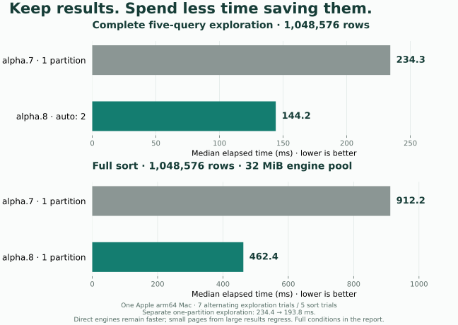

<div align="center">
  
  <h1>RowTrail</h1>
  <p><strong>Explore data. Keep the trail.</strong></p>
  <p>A small native data tool, built for agents.<br>Ask a question, keep an exact result, and continue from there.</p>
  <p>
    <a href="https://github.com/adam2go/rowtrail/actions/workflows/ci.yml"></a>
    <a href="https://github.com/adam2go/rowtrail/releases/tag/v0.1.0-alpha.8"></a>
    <a href="LICENSE"></a>
  </p>
  <p><a href="README.zh-CN.md">简体中文</a> · <a href="#install">Install</a> · <a href="docs/agent-guide.md">Agent guide</a> · <a href="docs/verification.md">Test results</a> · <a href="CONTRIBUTING.md">Contribute</a></p>
</div>

---

An agent should be able to explore a large table without putting the whole table
in its context. RowTrail opens local CSV/TSV/Parquet, runs read-only SQL, and keeps
versioned results on disk. The agent gets a bounded, typed observation and can
branch from a saved result when the next question arrives.

**New in alpha.8:** faster large-result persistence, resource-aware SQL
parallelism, and labeled results that a fresh agent connection can identify and
reuse. No new external dependency; the archive budget remains **30 MB**.

**Zero internal model calls. No API key. No spreadsheet UI.** Your agent chooses
the questions and decides when the evidence is sufficient.

| Built for | What the agent gets |
|---|---|
| **Observe progress honestly** | Exact row-group-prefix aggregates with explicit coverage and immutable revisions. |
| **Understand unfamiliar data** | On-demand null counts, min/max and exact top-k; every scan has budgets. |
| **Avoid repeated CSV parsing** | Explicit streaming preparation to an immutable Parquet dataset. |
| **Control stored data** | Pin/release, dependency-safe GC and managed-data quotas. |
| **Continue exploring** | Find labeled results, row counts and field hints with `workspace summary`; reuse fixed results through SQL. |
| **Spend context carefully** | Row and byte budgets, paginated observations, exact integer and Decimal representation. |
| **Work beyond one call** | Durable accepted jobs, explicit waiting, events and cancellation. |
| **Stay native and small** | Two executables; no Python, Node, Docker or external database required. |

```text
CSV / TSV / Parquet → exact query → saved result → next question
                          ↓              ↓
                    bounded observations for your agent
```

## Install

**v0.1.0-alpha.8** is an early engineering preview, licensed under Apache-2.0.
Native packages are available for **macOS arm64** and **Linux x86_64**
(Ubuntu 22.04 / glibc 2.35 or newer).

```sh
curl -fsSL https://raw.githubusercontent.com/adam2go/rowtrail/v0.1.0-alpha.8/install.sh -o /tmp/rowtrail-install.sh
sh /tmp/rowtrail-install.sh
export PATH="$HOME/.local/bin:$PATH"
rowtrail --version
```

The installer verifies SHA-256 and installs a versioned pair in `~/.local/bin`.
Set `ROWTRAIL_INSTALL_DIR` to choose another directory, or extract an archive
from [Releases](https://github.com/adam2go/rowtrail/releases/tag/v0.1.0-alpha.8).
Keep `rowtrail` and `rowtrail-runtime` together.

Verified native sizes (decimal MB):

| Platform | Download `.tar.xz` | CLI | Runtime |
|---|---:|---:|---:|
| macOS arm64 | **19.20 MB** | 3.73 MB | 100.08 MB |
| Linux x86_64 | **22.60 MB** | 4.19 MB | 114.91 MB |

CLI/runtime sizes are uncompressed. Budgets stay **30 MB / 4.5 MB / 125 MB**.
The same Linux archive is tested on Ubuntu 22.04 and 24.04. Archives include
agent guides and the optional runnable demo. [Artifact verification](docs/verification.md#native-distribution).

**Workspace upgrade:** alpha.8 upgrades metadata to schema 7. Old runtimes refuse
an upgraded store; stop its coordinator and retain a full pre-upgrade copy if you
need rollback.

## Give it a question

This example runs immediately after installation, with no data download:

```sh
rowtrail query --sql "SELECT region, SUM(amount) AS total
  FROM (VALUES ('east', 12), ('east', 8), ('west', 7)) AS orders(region, amount)
  GROUP BY region ORDER BY region"
```

The exact totals are `east = 20` and `west = 7`. The JSON response includes a
stable job reference and, when ready within the wait budget, a bounded result
observation. `ok: true` means acceptance; inspect `job.state` for completion.

For your own files, start with `rowtrail open ./orders.parquet`. Bind the returned
dataset and manifest IDs in SQL, then use a fixed result revision for the next
question. [The complete workflow](docs/usage.md#try-the-exact-exploration-loop)
covers opening, waiting, paging, branching and export. A
[runnable composition example](examples/explore.py) passes the references automatically.
The [alpha.3 end-to-end example](examples/prepare_explore.py) also profiles,
prepares, exports and collects its own intermediate data.
The [progressive example](examples/progressive.py) observes checkpoints and can
explicitly stop once it has enough fragment or file coverage.

## A complete demo, with no data download

With RowTrail on your PATH, run from this repository or an extracted archive:

```sh
python3 examples/quickstart.py
```

For an archive without installation, add `--rowtrail "$PWD/rowtrail"`.

This optional stdlib-only example generates **20,003 CSV rows**, discovers fields,
chooses a region from bounded aggregates, saves its refunds without returning
all those rows, then reconnects. One label-filtered catalog call finds the exact
saved binding; the next query reads **zero original-source bytes**. Python integer
checks verify the answer, including IDs above 2^53. Results remain in the printed
workspace for further exploration. [Demo source](examples/quickstart.py).

## Connect your agent

| Entry | Use it for | Start here |
|---|---|---|
| CLI | Discovery and one-off calls | `rowtrail guide` · `rowtrail schema query` · `rowtrail doctor` |
| Persistent NDJSON | Many operations in one process | `rowtrail session` · [protocol guide](docs/agent-guide.md) |
| MCP over stdio | Agent tool hosts | `rowtrail --workspace /absolute/private/workspace mcp-config` |
| Rust client | Native programmatic composition | [`Client::session()` example](crates/client/examples/query.rs) |

All entries share the same contracts, jobs and result store. Closing a connection
does not cancel an accepted job. Transport errors never silently replay a
possibly accepted mutation. The optional [Python bridge](examples/session_client.py)
uses only the standard library; Python is not a product dependency. Print it
locally with `rowtrail python-client > rowtrail_client.py`. `open` and `query`
responses can be passed straight into subsequent bindings; mechanical waits need
no extra model turn. [Small bootstrap](docs/agent-quickstart.md).

## Measured, with the receipts

Alpha.8 targets the complete exploration: opening unfamiliar data, saving a
subset, branching from it, and returning to the original dataset. Parallel targets
are explicit in measurements; direct engines retain their intermediate tables.
The [verification report](docs/verification.md) records repeated raw timings,
independent answer checks, native artifact hashes and unsuccessful experiments.

On one Apple arm64 Mac:

| Complete workload, median ms | alpha.7 | alpha.8 |
|---|---:|---:|
| 1M-row exploration, defaults (7 alternating trials) | 236.41 | **144.23** |
| 1M-row sort, 32 MiB engine pool (5 alternating trials) | 929.18 | **462.06** |

That is **39% / 50% less elapsed time**. Defaults use more partitions for large
scans; direct controls receive matching maximum targets. A separate one-partition
exploration comparison still improves **240.34 → 201.69 ms**. Small exploration
and warm scalar queries (about **1.10 ms**) remain essentially unchanged.



The changes preserve SQLite FULL commits, file/directory sync, verified parts and
real worker cancellation. Larger compressed parts reduce commit overhead but can
make a small read from a large saved result slower: the 100-row page grows from
**0.64 to 2.01 ms** in our million-row fixture. MemoryPool budgets are not
RSS caps. Package-size budgets remain unchanged.

**Direct engines remain faster.** RowTrail additionally pays for durable jobs,
immutable results, verification, process isolation and bounded protocol. A
persistent DuckDB environment is a strong choice if you already own those
lifecycles. The latest paired-agent pilot is still alpha.6: all 12 answers correct,
but RowTrail took more time and cumulative input tokens. Backend improvements and
the new runnable handoff demo do not establish a model-level latency/token win.

Both native build platforms pass **99 integration scenarios** and **nine Rust
tests**, including 12 subprocess commit-crash cases. A 5,000-result labeled history
survives restart; catalog lookup median is **0.54 ms** in that local probe.

[Current evidence](docs/verification.md) · [Alpha.8 raw records](benchmarks/performance/alpha8/) ·
[Archived alpha.7 report](docs/releases/alpha7-verification.md).

## What comes next

Progressive aggregation supports whole files and row groups, with no GROUP BY or
filters. Sampling/estimates, interrupted-run continuation,
a SQL prepared-plan cache, native MCP Tasks, automatic host resume/eviction and
remote sources remain unimplemented. [Current capabilities and limits](docs/progress.md) are
tracked separately from the roadmap.

We want a useful tool that stays easy to install, compose and understand.
Contributions that make the contracts clearer, the package smaller, or a
complete exploration faster are especially welcome. Start with
[contributing](CONTRIBUTING.md), [launch copy and demo rundown](docs/launch.md), [building from source](docs/usage.md#build), or
[a reproducible issue](https://github.com/adam2go/rowtrail/issues).

<sub>Meet <a href="docs/brand/README.md">Trail / 小迹</a>, our three-row companion. One question, one result, one more step.</sub>
