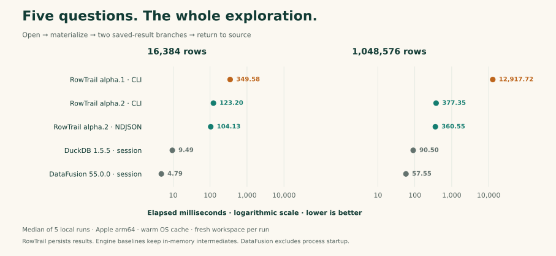

> Archived alpha.2 evidence. Measurements and supported features below are historical.

# Verification report — v0.1.0-alpha.2

**Verified on 2026-09-20.** Both native platforms passed the release checks below.
This report separates correctness, local repeated performance measurements and
artifact size. It is a record of this preview, not a guarantee for arbitrary SQL
or an external-agent adoption study. No verification workload calls a model.

[Home](../../README.md) · [中文首页](../../README.zh-CN.md) ·
[Machine-readable release evidence](../release-verification.json) ·
[Full benchmark method](../../benchmarks/README.md)

## Release evidence

| Item | Verified value |
|---|---|
| Runtime / client / installer / packaging source | [`12659c3`](https://github.com/adam2go/rowtrail/commit/12659c32e6cbf1dcbce090e296069486227438c1) |
| Passing CI | [Run 35482257736](https://github.com/adam2go/rowtrail/actions/runs/35482257736) |
| Platforms | Ubuntu 24.04 x86_64; macOS 14 arm64 |
| Release tag | [`v0.1.0-alpha.2`](https://github.com/adam2go/rowtrail/releases/tag/v0.1.0-alpha.2), commit `f9f4aa42122c01b8a6668fd98b4220c71f9273fc` |
| Toolchain | Rust 1.94.0, locked dependencies |

The tag adds documentation to the verified source. Later documentation and brand
changes on `main` do not replace the published binaries or their checksums.
The linked CI run contains the actual step logs and platform artifacts; the
checked-in JSON retains provenance when GitHub's artifact retention expires.

## What passed on each platform

| Check | Result on Linux and macOS | What it exercises |
|---|---|---|
| End-to-end suite | **30 / 30** | Exact data, persistence, revision reuse, budgets, cancellation and faults; inventory below. |
| Rust unit tests | **4 / 4** | Two client-session tests and two runtime error-classification tests. |
| MCP probe | **Passed** | Initialization, tool schemas, MCP-created result consumed by CLI. |
| NDJSON probe | **Passed** | Repeated calls, malformed JSON recovery, jobs surviving disconnect, cross-entry reads, oversized input rejection. |
| Rust SDK example | **Passed** | Persistent session and exact integer value above JavaScript's safe range. |
| Installer probe | **Passed** | Install actual archive, query via installed path, reject a corrupt archive checksum. |
| Real out-of-core execution | **Passed** | Million-row sort, observed spilling, bounded parts, independent verification of all exported IDs. |
| Engineering gates | **Passed** | Rust formatting, Clippy with warnings denied, client/engine dependency boundaries, distribution size budgets. |

The four unit tests are not counted again as integration checks. These totals
describe explicit assertions, not a code-coverage percentage. Test implementations:
[integration](../../tests/integration/exploration.py), [MCP](../../scripts/mcp_probe.py),
[session](../../scripts/session_probe.py), [SDK](../../crates/client/examples/query.rs),
[installer](../../scripts/install_probe.py), [boundaries](../../scripts/check_boundaries.py).

<details>
<summary>All 30 integration checks, in execution order</summary>

<!-- integration-inventory:start -->
1. bounded open / explicit Decimal schema / idempotent open.
2. relative paths resolve in each caller directory, independently of coordinator cwd.
3. S1 CSV and four-row-group Parquet agree with hand-calculated results.
4. typed parameters / large integer preservation / fixed revision pagination.
5. S2 two result-only branches avoid original reads; missing dimension requires original source.
6. multi-row-group Decimal aggregate matches independent integer reference.
7. coalesced multi-batch IPC preserves 10,000-row pagination and result-only SQL.
8. changing Arrow dictionaries remain readable and reusable across engine batches.
9. export fixed revision with quality sidecar and typed roundtrip.
10. query idempotency excludes wait but rejects changed semantics.
11. read-only SQL and explicit source access enforcement.
12. SQL identifiers cannot impersonate resource errors or invalidate valid sources.
13. real background submission / external cancellation / confirmed worker exit.
14. first preview survives eight cancellation races during coalesced result publication.
15. scan budget exhaustion does not masquerade as empty success.
16. computation timeout stops execution independently of client waiting.
17. export reserves input bytes before reading and does not publish on budget failure.
18. serialized observation budgets and result schema inspection.
19. large Unicode validation errors obey output budgets and signal truncation.
20. durable event replay and exclusive cursor.
21. atomic job snapshot supplies a compatible event replay cursor.
22. coordinator crash isolates old attempt, preserves committed results, and reports interrupted.
23. worker crash becomes interrupted with confirmed process exit.
24. corrupt committed part fails explicitly instead of returning an empty table.
25. genuine empty result has a schema and final committed revision.
26. bounded head inspection uses a real limited query and fixed result.
27. late CSV type failure preserves partial results and propagates quality through queries and export.
28. multi-file imports conservatively merge quality and empty CSV exports retain headers.
29. source version mismatch and downstream invalidation.
30. refresh freezes a new manifest while preserving old result invalidation.
<!-- integration-inventory:end -->

These are the named checks in the source, not 30 separate benchmark runs. The
[local trace](../../benchmarks/traces/macos-local.json) records requests and responses.
Large page arrays in that committed trace are explicitly shortened and include
hashes; CI verification artifacts contain full platform reports.

</details>

## Local performance



The plot is generated from [summary.json](../../benchmarks/performance/summary.json).
Its axis is **logarithmic**; each dot is a median of **five** runs, not a score.
Direct-engine figures use the alpha.2 CLI comparison run. Exact values and raw
samples remain available below; [regenerate the plot](../../benchmarks/plot.py)
with `python3 benchmarks/plot.py` in a development environment with Matplotlib.

**Conditions:** Apple arm64, macOS 26.6.2, 24 GiB RAM, 14 logical CPUs, Rust
1.94.0 release. Serial runs, no concurrent build/test workload, warm OS cache.
Each repeat starts a fresh RowTrail workspace and fresh reference-engine sessions.
CLI timing includes a process per operation; NDJSON includes starting one process.

The five SQL steps are region totals, a saved filtered projection, region totals
from the saved result, a positive-row count from that result, and product counts
back on the original source. Opening and materialization are included. Query
answers are checked against DuckDB. All work is exact, without sampling.

| RowTrail entry | Rows | Minimum ms | Median ms | Maximum ms | All five runs |
|---|---:|---:|---:|---:|---|
| Alpha.1 CLI | 16,384 | 326.50 | 349.58 | 456.37 | [JSON](../../benchmarks/performance/before-cli-16384.json) |
| Alpha.2 CLI | 16,384 | 122.74 | 123.20 | 132.33 | [JSON](../../benchmarks/performance/after-cli-16384.json) |
| Alpha.2 NDJSON | 16,384 | 103.73 | 104.13 | 104.36 | [JSON](../../benchmarks/performance/after-session-16384.json) |
| Alpha.1 CLI | 1,048,576 | 12,220.91 | 12,917.72 | 13,456.86 | [JSON](../../benchmarks/performance/before-cli-1048576.json) |
| Alpha.2 CLI | 1,048,576 | 373.95 | 377.35 | 422.63 | [JSON](../../benchmarks/performance/after-cli-1048576.json) |
| Alpha.2 NDJSON | 1,048,576 | 356.62 | 360.55 | 370.25 | [JSON](../../benchmarks/performance/after-session-1048576.json) |

Same CLI, same workload: **2.84× / 34.23× faster than alpha.1**. Persistent
DuckDB 1.5.5 measures **9.49 / 90.50 ms**; direct DataFusion 55.0.0 measures
**4.79 / 57.55 ms**. They are allowed in-memory intermediate tables. DataFusion's
reported time excludes process startup; its process wall time is also recorded.
RowTrail pays for disk durability, process isolation and protocol. These results
establish an improvement over the earlier RowTrail implementation, not a general
advantage over the underlying engines.

The representative million-row filter writes **9 parts**, down from roughly
1,024. Each saved-result branch makes **28 data read requests**, down from 3,073,
with **zero original-source bytes read** in both versions. Original-source reads
are unchanged. Durability, exact types and fixed revisions remain in force.

### Paging

Five warm-cache reads of each page size from a fixed sorted 16,384-row result,
same CLI entry. Every returned Int64 ID is checked, including exact JSON strings.

| Page rows | Alpha.1 median ms | Alpha.2 median ms |
|---|---:|---:|
| 100 | 5.31 | 3.51 |
| 1,000 | 12.33 | 5.00 |
| 10,000 | 570.25 | 21.37 |

The largest page improves **26.68×** on this workload without relaxing byte
budgets or revision-fixed cursors. Raw samples and executable hashes:
[before](../../benchmarks/performance/before-paging.json),
[after](../../benchmarks/performance/after-paging.json).

## Out-of-core correctness and memory

The real coordinator/worker sorts **1,048,576 rows** from **228,139,988 source
bytes** with a **33,554,432-byte (32 MiB) engine pool** and 512 MiB spill allowance.
An independent Python integer-key sort specifies the full expected order.
DuckDB only reads the exported Parquet for this comparison; it does not calculate
the expected order. Every ID must match, not just the first page or a row count.

| Run | Sort + observation ms | Spill operations | Sampled worker RSS bytes | Full exported order |
|---|---:|---:|---:|---|
| Local Mac | 1,394.24 | 26 | 145,997,824 | Matched |
| Linux CI | 2,231.72 | 26 | 139,710,464 | Matched |
| macOS CI | 2,807.36 | 26 | 139,018,240 | Matched |

These are individual resource-validation runs, **not** the five-repeat exploration
benchmark above. Do not use this table to rank operating systems. Local export
takes 512.52 ms; the sort publishes 64 parts, largest 3,363,970 bytes.

The 32 MiB engine pool is **not a hard RSS limit**. RSS is sampled with `ps` and
may miss the actual peak. This verifies one real spill workload; broad joins,
aggregates, adversarial inputs and a wider fault matrix remain future work.
[Local raw report](../../benchmarks/performance/resources.json) ·
[CI values and provenance](../release-verification.json) ·
[Verification implementation](../../benchmarks/resources.py)

## Native distribution

The immutable [alpha.2 release](https://github.com/adam2go/rowtrail/releases/tag/v0.1.0-alpha.2)
contains the two executables, project license and dependency notices, compressed
with xz level 6. End users need no language runtime or external engine.
The mascot, plots and test fixtures are repository material and are excluded by
[the package's explicit file list](../../scripts/package.py).

| Artifact target | Compressed bytes | CLI bytes | Runtime bytes | Installed binary pair bytes |
|---|---:|---:|---:|---:|
| `aarch64-apple-darwin` | 19,000,420 | 3,568,048 | 99,602,720 | 103,170,768 |
| `x86_64-unknown-linux-gnu` | 22,241,924 | 4,009,968 | 114,223,840 | 118,233,808 |

Compression reduces download size, not installed binary size or runtime memory.
Installed pair sizes exclude notices and workspace data. Linux binaries require
glibc 2.39 or newer; the macOS build was verified on macOS 14 arm64. Windows,
Linux arm64 and Intel macOS packages are not currently published.

SHA-256 of `rowtrail-0.1.0-alpha.2-aarch64-apple-darwin.tar.xz`:

```text
fe0d4bf742b1b92a1c08c7797df3215a7fa67f62dd0eb4f14fcb57cc38fedf50
```

SHA-256 of `rowtrail-0.1.0-alpha.2-x86_64-unknown-linux-gnu.tar.xz`:

```text
600f3ff0284bde8a1d40f28da531da13e59186d269f7b52e46d16a09e9975289
```

Both downloaded package checksums were verified locally. The macOS CI archive
was also installed and executed locally; Linux execution was verified in CI.
CI enforces [binary and archive budgets](../../benchmarks/budgets.json).

## Reproduce

From a checkout with Rust 1.94.0, a native C toolchain and Python 3.11+ for
verification scripts (Python is not required by the released product):

```sh
cargo fmt --check
cargo clippy --locked --workspace --all-targets -- -D warnings
python3 scripts/check_boundaries.py
cargo build --release --locked
cargo test --release --locked --workspace
python3 tests/integration/exploration.py --bin-dir target/release
python3 scripts/mcp_probe.py target/release/rowtrail
python3 scripts/session_probe.py target/release/rowtrail
ROWTRAIL_RUNTIME="$PWD/target/release/rowtrail-runtime" \
  cargo run --locked -p rowtrail-client --example query -- /tmp/rowtrail-sdk
python3 scripts/package.py
python3 scripts/install_probe.py
```

On macOS, `./scripts/cargo-local.sh` can replace `cargo` to select an independently
installed Command Line Tools toolchain for that command only. It does not change
the global Xcode selection. Use ordinary Cargo on Linux.

For performance and the independent full-order verification, install DuckDB only
in a separate development environment. Give every run its own output path:

```sh
python3 -m venv /tmp/rowtrail-verification
/tmp/rowtrail-verification/bin/pip install duckdb==1.5.5
for rows in 16384 1048576; do
  for entry in cli session; do
    /tmp/rowtrail-verification/bin/python benchmarks/compare.py \
      --rows "$rows" --entry "$entry" --repeats 5 \
      --output "benchmarks/local/$entry-$rows.json"
  done
done
python3 benchmarks/paging.py
/tmp/rowtrail-verification/bin/python benchmarks/resources.py
```

Run performance experiments serially on an otherwise idle machine. These
commands exercise the checked-out version; reproducing the before/after
comparison requires separate builds at the commits in
[summary.json](../../benchmarks/performance/summary.json). Preserve source commit,
conditions, repeats and executable hashes with any new claim. Timing differences
between machines are expected; shared CI runners do not enforce a universal
millisecond threshold.

## Boundaries of this evidence

- The deterministic suite establishes the tested contracts. It does not prove
  all SQL plans, all failure interleavings or production readiness.
- No paired external-agent trial has measured task success, model-token savings
  or adoption. Those benefits remain hypotheses to test.
- Local source consistency uses identity/size/mtime checks, not filesystem
  snapshots. Partial coverage, completion, accuracy and output truncation remain
  separate properties.
- Historical `benchmarks/m0.json`, `baseline.json` and `client-startup-macos.json`
  describe earlier runs, not current alpha.2 artifact sizes.
- Sampling, prepared execution, native MCP Tasks, host auto-resume, remote sources
  and automatic GC remain unimplemented. See [progress and limitations](../progress.md).
