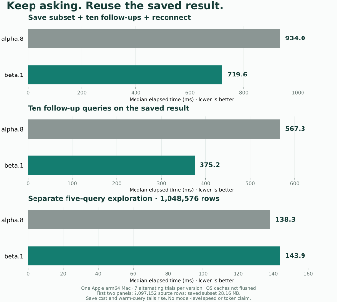

# Verification: beta.1

[Home](../README.md) · [Numeric contract](numeric-contract.md) · [Current limits](progress.md)

Beta.1 checks integer/Decimal SUM, stabilizes reconnection, extends the optional
stdlib client and reduces duplicate saved-result reads. This report separates
correctness, backend measurements, native distribution and agent-level evidence.
[Alpha.8 evidence](releases/alpha8-verification.md) and
[provenance](releases/alpha8-verification.json) remain archived.

**Release status:** [native CI](https://github.com/adam2go/rowtrail/actions/runs/35757844420)
and independent archive verification pass for source
`cbde5d1556dacf7506e9afb3e57083183eb3f927`. Both platforms pass all 113 integration
scenarios and 14 Rust tests; the same Linux archive passes Ubuntu 24.04 installation.
[Machine-readable provenance](release-verification.json).

## Correctness and upgrade

The final local build passes **113 integration scenarios**: 30 foundation,
13 alpha.3, ten alpha.4, twelve alpha.5, eight alpha.6, fifteen alpha.7, eleven
alpha.8 and fourteen new beta scenarios (the script retains its `alpha9.py`
development name). **Fourteen Rust tests** include twelve subprocess publication
crash cases, broken-ACK handling, stop-reason consistency and numeric aggregation
boundaries. Formatting, Clippy, dependency boundaries and MCP/session probes pass.
[Local check inventory](../benchmarks/performance/beta1/verification.json).

The [new integration suite](../tests/integration/alpha9.py) covers structured
overflow failures with no final invalid revision, widened exact values, grouped /
DISTINCT / sliding-window SUM, invalid Decimal output, prepare/inspect/export,
reconnection, strict label lookup, bounded/resumable pagination, unknown legacy
ancestry through three derivations, descriptor mismatch, permissions, concurrent
startup and malformed-client-response handling. A saved result larger than the
8 MiB cache is queried twice with an exact one-pass byte budget; both queries
return independently checked answers, read zero original bytes and revalidate
the saved data without exceeding the cache.

Rust tests exercise real two-partition partial merges and Decimal32/64/128/256
arrays. Checked i128 batch lanes flush into checked i256 state on overflow; a
case exceeding i128 intermediate capacity but cancelling to 42 verifies this
behavior. Nulls, window retractions, DISTINCT duplicates and hidden invalid
Decimal children beneath null/sliced/nested arrays are also covered.

**Numeric scope is finite and explicit.** Integer/Decimal SUM checks its declared
output range. Decimal values are validated before persistence, read and export.
`ARITHMETIC_OVERFLOW` preserves operation, type, expression and recovery details.
Float SUM, AVG, scalar arithmetic and casts otherwise retain engine semantics.
`accuracy: exact` describes sampling, not arbitrary-precision arithmetic or
certification of the input. [Full numeric contract](numeric-contract.md).

**Schema 8 is a one-way upgrade from 3/4/5/6/7.** Tests using the checksum-pinned,
published alpha.8 archive preserve old fixed results and partial checkpoints,
and verify the old runtime refuses an upgraded store. An old wrapped integer
cannot be reconstructed; it stays immutable with unknown numeric provenance.
An old invalid Decimal now fails read, derived SQL and export before misleading
display or final publication. New derivations retain unknown input ancestry.
Stop the old coordinator and keep a full pre-upgrade workspace copy for rollback.

Connection tests change TMPDIR while preserving the same workspace/coordinator,
check workspace/store/PID/runtime identity, restart a stopped coordinator, and
exercise long paths and eight concurrent cold clients. Failures are typed and
do not replay possibly accepted work. The private descriptor uses complete write
plus atomic rename; it is ephemeral discovery metadata. Removing its unnecessary
fsync does not change job/result durability.

## Method

One Apple arm64 Mac, macOS 26.6.2, **24 GiB RAM / 14 logical CPUs**, Rust 1.94.0
release builds. Serial alternating version order, identical deterministic inputs,
fresh workspaces and no concurrent local builds or timed workloads. **OS caches
are not flushed.** Every sample and executable hash is retained. The local
benchmark binaries are distinct from the independently built native CI artifacts.
These are local measurements, not universal speed guarantees or a reproduction
of the external tester's network-filesystem environment.

All timing tables use medians unless marked otherwise. Component medians are
not an additive decomposition of the median total; parallel engine counters
are not additive wall time. MB means 1,000,000 bytes; MiB means 1,048,576 bytes.
[Raw files and reproduction commands](../benchmarks/performance/beta1/).

## Save, ask ten more questions, reconnect

[Seven alternating trials per version](../benchmarks/performance/beta1/followup-2097152.json)
start from **2,097,152 rows / 456.28 MB** of deterministic Parquet. Save a subset
with **1,677,722 rows / 28,162,878 bytes / seven parts**, run ten different
COUNT/SUM/MIN/MAX queries over it, close/reconnect, find its unique label in one
catalog call and repeat a query on the same fixed result. Python integer/Decimal
arithmetic independently verifies every answer, including IDs above 2^53. The
whole subset is never returned to the agent.

| Measured operation | alpha.8 | beta.1 |
|---|---:|---:|
| Complete task, ms | 934.02 | **719.63** |
| Save subset, ms | 263.86 | 275.22 |
| Ten follow-up queries, ms | 567.27 | **375.18** |
| Reconnect and discover, ms | 4.52 | 4.39 |
| Resumed query, ms | 61.11 | 39.82 |
| Saved-data bytes per follow-up, MB | 82.03 | **28.16** |
| Original-data bytes per follow-up | 0 | 0 |
| Total returned response-envelope bytes | 30,922 | 33,777 |

Complete elapsed time falls **23.0%** and the ten-query stage **33.9%**. Saved-data
reads fall **65.7%**. First-save cost rises **4.3%**, and richer numeric metadata
and diagnostics increase response bytes **9.2%**. Bytes are measured UTF-8 frames,
not tokenizer estimates. No token reduction is claimed.

The saved Arrow source already knows its IPC file format. It skips format
sniffing and keeps files whole instead of creating byte ranges that each require
full-part verification. Separate files remain parallel. Both versions target two
partitions in the large follow-ups. The final candidate reads each saved part
once per query in this workload, with an observed cache peak of **5,753,028 bytes**
inside the existing **8 MiB per-job** bound. Each new job still verifies SHA-256;
there is no cross-job content cache. The `verified_part_load_ms` counter includes
read, checksum and blocking-task scheduling, not just checksum CPU time.

SQLite FULL commits, file/directory sync, commit-before-ACK ordering, immutable
revisions, shared scan reservations and actual cancellation remain in place.
[Design decision](decisions/009-numeric-reconnection-and-reuse.md).

## Other workflows and costs

The existing five-query exploration starts a persistent session, opens input,
aggregates regions, saves non-null rows, queries two saved branches and returns
to the original product dimension. Seven alternating trials per version:

| Complete exploration, median ms | alpha.8 | beta.1 |
|---|---:|---:|
| 16,384 rows | 36.76 | 36.47 |
| 1,048,576 rows | 138.31 | 143.90 |
| High-entropy numeric save/reuse, 131,072 rows | 95.93 | 97.66 |

Small exploration is essentially unchanged; the million-row workflow takes
**4.0% longer** and the entropy workload **1.8% longer** in this series. Numeric
checking and richer contracts are not free. These measured differences are
retained rather than presented as a universal performance improvement.

Persistent DuckDB 1.5.5 and direct DataFusion 55.0.0 retain intermediates in memory.
In the beta.1 million-row arm they take **71.66 / 37.36 ms**, faster than RowTrail.
Controls receive the largest RowTrail target in that trial (two for million-row
inputs, one for small inputs); RowTrail may use fewer for its saved data. Threads
and partition targets are not equivalent CPU caps. Controls use their default
memory limits and do not provide equivalent durable jobs/results; DataFusion
excludes startup from its stage sum and records process wall time separately.
RowTrail answers are checked against DuckDB; the direct DataFusion timing harness
records stage row counts, not independent serialized answer comparison.

[16K exploration](../benchmarks/performance/beta1/exploration-16384.json) ·
[1M exploration](../benchmarks/performance/beta1/exploration-1048576.json) ·
[Entropy, independent oracle](../benchmarks/performance/beta1/entropy.json).

Eleven fresh-workspace sessions, 100 queries per session; first query separated
from the **1,089 warm observations** per version:

| Latency, ms | alpha.8 | beta.1 |
|---|---:|---:|
| Workspace startup median | 18.93 | 19.13 |
| First query median | 6.48 | 6.12 |
| Warm query median | 0.876 | 0.893 |
| Warm query p95, nearest rank | 1.387 | 3.379 |
| Warm query maximum | 12.519 | 13.709 |

Warm medians remain below 1 ms here, but **p95 regresses**. An earlier candidate
with an unnecessary descriptor fsync severely regressed startup; removing only
that ephemeral barrier restored normal startup. A **2.12-second first invocation**
of the subsequent binary is retained in its separate experiment. Fresh-workspace
startup is not a guarantee for a never-executed binary or an uncached system.
[Final latency](../benchmarks/performance/beta1/latency.json) ·
[All rejected candidates and outliers](../benchmarks/performance/beta1/experiments/).

Two projected columns from a wide million-row saved result, 21 trials per page
size, remain approximately unchanged:

| Requested rows, median ms | alpha.8 | beta.1 |
|---|---:|---:|
| 100 | 2.048 | 2.037 |
| 1,000 | 2.313 | 2.323 |
| 10,000 | 6.948 | 6.924 |

[Paging raw data](../benchmarks/performance/beta1/paging-1048576.json) retains
byte counts and p95. Small observations still pay whole-part integrity costs;
the scan change does not remove that limitation.

## Resource limits

Five million-row full sorts per version with a **32 MiB query-engine pool** spill
to disk; every exported ID matches an independent Python sort.

| Resource workload, median | alpha.8 | beta.1 |
|---|---:|---:|
| Sort including observation, ms | 470.89 | 462.74 |
| Export, ms | 255.33 | 248.49 |
| Spill count | 26 | 26 |
| Result parts | 3 | 3 |
| Largest encoded part, bytes | 4,655,714 | 4,655,714 |
| Sampled worker peak RSS, MB | 142.43 | 138.20 |

The engine pool is **not a process RSS limit**. Codec buffers, metadata, caches
and other allocations live outside it. `ps` sampling does not capture an exact
peak or prove a hard bound. No RSS claim is made for the ten-follow-up benchmark.
[All resource trials](../benchmarks/performance/beta1/resources.json).

## Native distribution

All release executables come from the passing native CI source above. Downloaded
archives were independently checked for SHA-256, native architecture, exact
agreement with integration/resource-test binary hashes, **557 dependency notice
files** each, Apache-2.0, and bundled guides/client/demo. Both native platforms
pass installation, checksum rejection and real published alpha.8 upgrade probes.
The same Linux archive also passes installation/demo on Ubuntu 24.04.

| Native target | Archive bytes | CLI bytes | Runtime bytes |
|---|---:|---:|---:|
| macOS arm64 | **19,368,188** | 3,816,464 | 100,962,320 |
| Linux x86_64, glibc 2.35+ | **22,713,120** | 4,327,104 | 115,904,136 |
| Budget | 30,000,000 | 4,500,000 | 125,000,000 |

Downloads are **19.37 / 22.71 MB**, up only **0.165 / 0.113 MB** from alpha.8.
No external product dependency was added. Python and Matplotlib are optional
example/maintainer tools, not shipped runtimes.

| Archive | SHA-256 |
|---|---|
| macOS arm64 | `6dcdb07b5b505724669eb8b7a10dac0db2747e6f9a8fa2c708c1d6e55cad28b5` |
| Linux x86_64 | `34f759a17a8d28165afbc8dfeeb5bfa7a1d858bb4704fd11f4e5905872faf351` |

[Full artifact and native-test provenance](release-verification.json).
Archive documents reflect the verified build source; later README/release-report
updates on the tag do not change those executable bytes. Local benchmark hashes
are deliberately retained separately from the CI release hashes.

The actual macOS CI archive is also extracted and installed on the local Mac.
Its [fourteen new integration scenarios](../benchmarks/performance/beta1/native-macos-alpha9.json),
[published alpha.8 metadata upgrade](../benchmarks/performance/beta1/upgrade-native-macos.json),
[legacy numeric upgrade](../benchmarks/performance/beta1/numeric-upgrade-native-macos.json)
and [installation / bundled demo](../benchmarks/performance/beta1/install-native-macos.json)
all pass. These records carry the native artifact hashes, not the local timing hashes.

The beta name reflects acceptance of the bounded local CLI/session/MCP workflow.
It does not promise stable 1.0 metadata, signed/notarized binaries, Windows,
remote data sources or general arbitrary-precision SQL arithmetic.

## What remains unproven

There is **no new same-agent paired trial** in beta.1. The latest alpha.6 pilot
answered all twelve tasks correctly, but RowTrail took more total time and
cumulative input tokens than persistent DuckDB. Faster backend reuse does not
establish model-level speed, token efficiency or adoption.

Progressive aggregation still excludes GROUP BY and filters. Interrupted
computation is not resumed automatically; accepted work survives client disconnect
and readable committed revisions survive failure according to the job contract.
Remote sources, native MCP Tasks and a SQL prepared-plan cache remain future work.
Independent real tasks, other machines/filesystems, warm-tail analysis and smaller
native distributions are useful next contributions. [Current limits](progress.md).
