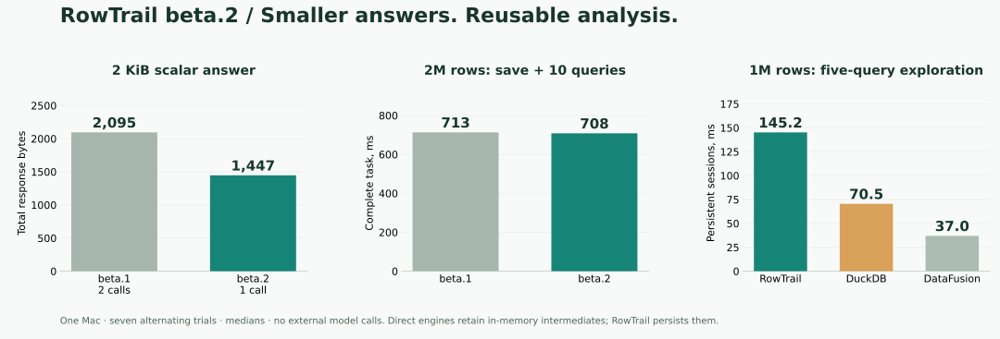

# Verification: beta.2

[Home](../README.md) · [Analysis contracts](analysis.md) · [Current limits](progress.md)

Beta.2 adds native independent snapshots and optional stdlib analysis composition:
assertions, keyed diffs, durable SQL recipes and portable result branches. It adds
no external dependency. This page is being finalized during native release CI;
artifacts are published only after both native platforms and archive checks pass.

## Correctness gates

129 integration scenarios (113 existing + 16 beta.2) and 14 Rust tests, including
12 subprocess crash cases. New cases cover Parquet/result snapshot independence,
idempotency, bounded provenance, 2 KiB one-call observations, keyed comparison,
SQL/schema checks, partial rejection, durable recipes, package/import/recompute,
corruption/path/symlink/byte-limit rejection and retained partial failure records.

Formatting, Clippy, client/runtime dependency boundaries, real MCP/session/Rust
client contracts, out-of-core limits, install/checksum rejection and both bundled
demos are required. Pinned public alpha.8 and beta.1 archives exercise real one-way
metadata upgrades to schema 9, preserving old fixed results and partial checkpoints.
Older runtimes reject the upgraded store. Numeric provenance remains unchanged.

## Local measurements

Serial alternating beta.1 and beta.2 runs on one Apple arm64 Mac, macOS 26.6.2,
24 GiB RAM / 14 logical CPUs, Rust 1.94.0. Fresh workspaces; OS caches not flushed;
no concurrent local builds or timed workloads. Raw repeats and binary hashes are
retained. These are backend tests without external models, not adoption evidence.

[Raw records, hashes and reproduction](../benchmarks/performance/beta2/).

| Metric (median unless specified) | beta.1 | beta.2 |
|---|---:|---:|
| 2 KiB scalar: calls / total response bytes | 2 / 2,095 | 1 / 1,447 |
| 2 KiB scalar end-to-end, ms | 0.948 | 0.874 |
| 8 KiB scalar, ms | 0.862 | 0.869 |
| Save + ten follow-ups + reconnect, 2M rows, ms | 713.04 | 708.25 |
| Save component, ms | 283.18 | 284.52 |
| Ten follow-ups component, ms | 353.16 | 357.12 |
| Five-query 1M-row exploration, ms | 145.06 | 145.20 |
| Cold startup, ms | 18.43 | 18.38 |
| Warm query, ms | 0.879 | 0.878 |
| Warm p95, ms | 1.281 | 1.282 |
| Read 10,000 projected rows, ms | 5.087 | 5.120 |

The bounded scalar saves one call and about 31% of response bytes. Its sampling,
coverage and completion quality remain visible; optional job metrics move out
of that tight response and remain available from status. These are UTF-8 bytes,
not token estimates. The 8 KiB path and larger workflows are broadly unchanged,
with small regressions in some components. Earlier runs varied in both directions;
all are retained, including a 215 ms warm outlier from an earlier candidate.
No tail-latency guarantee or general engine speedup is claimed.

Seven alternating exploration trials retain fair persistent-session controls:
**RowTrail 145.20 ms / DuckDB 70.47 ms / direct DataFusion 37.00 ms** in the beta.2
series. RowTrail pays for durable storage, checksums and process isolation;
direct engines retain intermediates. Each setup is disclosed in the raw records.

### Complete new analysis workflow

On **131,072 rows**, five serial fresh-workspace trials yield **863.76 ms** median
for snapshot, before/after results, diff, assertion, aggregate, full package,
offline verification, fresh-workspace import, follow-up and explicit recipe rerun.
Every result agrees with an independent Python integer/Decimal oracle.

| Component | Median ms |
|---|---:|
| Independent snapshot | 157.04 |
| Keyed diff, including duplicate/null checks and examples | 35.63 |
| SQL uniqueness assertion | 4.73 |
| Package with input payloads and bounded report previews | 159.06 |
| Offline byte verification | 12.34 |
| Import independent copies, schema and count checks | 335.49 |
| Explicit recipe rerun | 47.82 |

Component medians are not an additive decomposition. The complete workflow uses
49 native calls, mechanically composed without a model, about 99.9 KB of protocol
responses and a 30.7 MB **data package**. No full table is fetched into Python.
Data package size depends on included data, separately from the installation
archive. Import's private streaming copy closes verification/open races and keeps
active inputs on helper deadline. Copying and verifying data is its main cost.
This workflow has no equivalent-feature beta.1 speed comparison.

### Memory-limited sort and paging

Five alternating million-row sorts with a **32 MiB engine pool** spill in both
versions. Every exported ID matches an independent Python ordering; DuckDB only
reads the Parquet for verification. Sort median is **448.88 → 433.20 ms**, export
**236.42 → 235.76 ms**. Both publish three parts, largest **4,655,714 bytes**, with
26 spills. Sampled worker peak RSS is **139.30 → 142.31 MB**; the engine pool is
not a process RSS cap and polling can miss actual peaks. This local difference
is observational, not a new sort optimization claim.

Twenty-one projected-page trials retain exact IDs: 100 rows **0.342 → 0.302 ms**,
1,000 rows **0.665 → 0.677 ms**, 10,000 rows **5.087 → 5.120 ms**. Larger reads are
slightly slower. No result-reading code was changed to claim a paging speedup.

## Native distribution

Unchanged budgets: 30,000,000 compressed bytes, 4,500,000 CLI bytes and 125,000,000
runtime bytes. Only passing native macOS arm64 / Ubuntu 22.04 x86_64 CI artifacts
are published; the same Linux archive is installed and tested on Ubuntu 24.04.
Archive hashes, bundled files, installed printed client/demos and all 557 dependency
notices must match independently before publication. Native CI remains pending.

## Limits

- Diff checks keys and performs multiple scans; bounded examples do not bound scan
  work. Modified rows cover only common identically typed non-key columns.
- Recipe/check/package helpers are Python composition, not native MCP tools. They
  add no dataframe library, model calls, scheduler or automatic retries.
- Checks save complete violations within execution limits. Partial, failed or
  nonfinal work cannot pass. Schema leakage checks use exact column names.
- Package checksums verify bytes, not authorship or business claims. Import does
  not execute SQL. Original recomputation requires explicit mapped inputs/run.
- Per-job budgets remain distinct from whole-workflow cost. Multi-step operations
  are not whole-workflow transactions; completed work survives later failures.
- Existing source invalidation and numeric contracts remain. No automatic legacy
  recertification, source snapshot filesystem guarantee, Windows or remote support.
- The latest paired-agent trial remains alpha.6: correct answers, but more time
  and cumulative input tokens than persistent DuckDB. No model-level gain claimed.

[Beta.1 report](releases/beta1-verification.md) ·
[Beta.1 native provenance](releases/beta1-verification.json) ·
[Design decision](decisions/010-portable-analysis.md).
